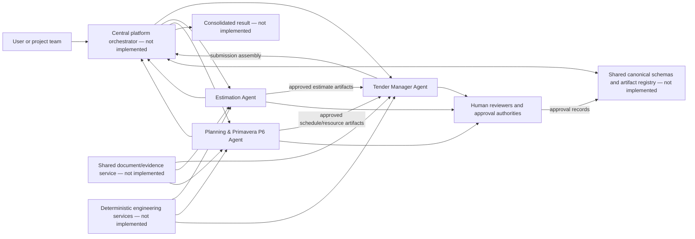
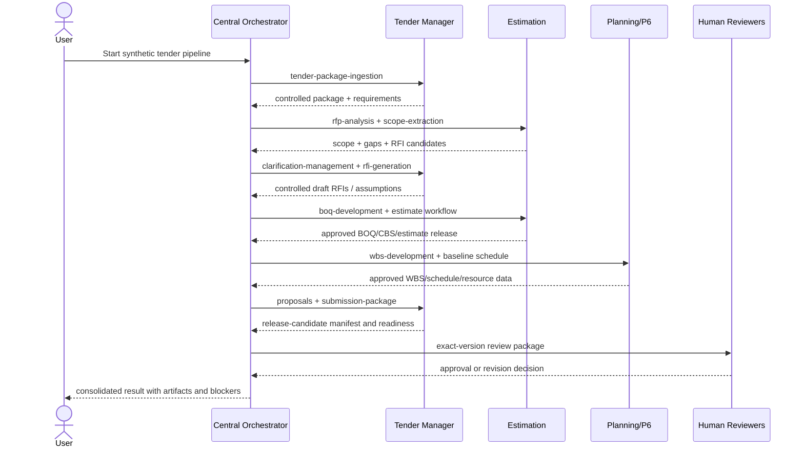

# Current system map

## 1. Current logical topology

The boxes marked not implemented exist only in the architecture narrative. Today, users must select and sequence workflow specifications manually.

## 2. Agent map

### Estimation Agent

Mission: produce traceable construction estimate and pricing artifacts from controlled scope, quantities, rates, quotations, methods, and commercial rules.

Primary inputs:

- RFP/tender documents, addenda, drawings, specifications, scope, and design basis.
- BOQ, quantity sources, measurement profile, WBS/CBS/cost codes.
- Labor, material, plant, subcontract rates, quotations, productivity, logistics, taxes, currency, escalation, and risk.
- Planning schedule/methodology inputs where approved.

Primary outputs:

- RFP briefing, scope matrix, information gaps, technical RFI candidates, and commercial queries.
- Design basis, BOQ, CBS, cost-model specification, quotation comparison, and pricing risk.
- Approved estimate/pricing artifacts and technical/commercial contribution drafts.
- Current conflicting output: `final-bid-package`, which overlaps Tender submission ownership.

Dependencies:

- Document/OCR parser, evidence service, unit/currency/quantity/rate/cost engines, spreadsheet generator/validator, quotation normalization, and review/approval service.
- Planning schedule and future QS/BIM quantity artifacts.

### Planning & Primavera P6 Agent

Mission: develop, validate, update, and analyze construction schedules through controlled evidence and deterministic scheduling calculations.

Primary inputs:

- Scope, deliverables, contract milestones, WBS/coding, design, procurement, construction strategy, and site calendars.
- Productivity, resources, availability, CBS/cost data, payment rules, procurement packages, and design/submittal cycles.
- Baselines, updates, actuals, field status, delay events, contemporaneous records, and recovery constraints.

Primary outputs:

- WBS, activity register, calendars, relationships, baseline schedule model, basis/narrative, and quality report.
- Resource/cost-loaded schedules, histograms, cash flow, procurement, material-submittal, and shop-drawing schedules.
- Progress updates, variance, delay analysis, recovery schedules, and TIA artifacts.

Dependencies:

- CPM/calendar/resource/cost/cash-flow/fragnet engines, schedule quality validator, P6 XER/XML adapter, file round-trip validator, and professional planning review.
- Controlled scope from Tender/Estimation and approved cost/resource inputs.

### Tender Manager Agent

Mission: control complete tender packages, coordinate requirements and queries, assemble approved content, and prepare a submission release candidate.

Primary inputs:

- Invitation, complete tender package, indexes, addenda, client clarifications, evaluation criteria, forms, portal rules, and deadlines.
- Approved Estimation, Planning, and future QS/BIM/QA/QC/HSE/Contracts/Finance artifacts.
- Verified company, project, credential, personnel, equipment, and approval data.

Primary outputs:

- Document/addendum/deadline registers, folder specification, compliance matrix, clarifications, RFIs, assumptions, and exclusions.
- Execution methodology, organization/RACI, equipment schedule, manpower histogram specification, and tender schedule coordination.
- Technical and commercial proposals, forms/approval controls, submission manifest, preflight report, and readiness recommendation.

Dependencies:

- Document/revision/requirement services, company-content registry, office/chart renderers, file preflight/security/package services, and all approved domain artifacts.

Tender Manager is the bid-domain assembly coordinator. It is not the main platform orchestrator because it cannot route arbitrary non-tender requests or own Estimation/Planning calculations.

## 3. Required artifact exchanges

| Producer | Artifact | Consumer | Required controls |
|---|---|---|---|
| Tender | Controlled tender package and addendum set | Estimation, Planning | Source IDs, revisions, checksum, source cutoff, current/superseded state |
| Tender | Compliance and requirement matrix | Estimation, Planning | Atomic requirement IDs, owner, mandatory/scored state, citations |
| Estimation | Scope matrix | Planning, Tender | Approved version, WBS/BOQ mapping, assumptions, exclusions, evidence |
| Estimation | Gap/query candidates | Tender | Candidate status, source, estimate impact, deadline; Tender controls issue |
| Estimation | BOQ/CBS/estimate release package | Tender | Schema/version, currency, pricing date, quantities/rates, reconciliation, approval |
| Planning | WBS and schedule package | Tender | Schedule ID/version, data date, calendars, logic/quality report, approval |
| Planning | Resource assignments and histogram data | Tender | Schedule version, calendar, unit/hour basis, deterministic calculation trace |
| Planning | Procurement/design schedules | Tender | Package/submittal/drawing IDs, need dates, logic, risks, approval |
| Tender | Approved assumptions/exclusions/clarifications | Estimation, Planning | Stable IDs, scope/cost/time impact, source or decision, approval |
| Tender | Technical/commercial assembly and manifest | Central orchestrator | Requirement coverage, exact artifact versions, checksums, review status |
| All agents | Findings, blockers, approvals, metrics | Central orchestrator | Shared envelope, severity/status vocabulary, provenance, correlation ID |

## 4. Proposed main orchestrator

The main orchestrator should be a neutral platform component under `packages/orchestrator`, not one of the domain agents.

Responsibilities:

1. Validate request/project/tender metadata and authorization context.
2. Resolve a user intent to a fully qualified workflow key.
3. Load the agent manifest, workflow contract, prompt set, schemas, policies, and required tools.
4. Validate inputs and check prerequisite artifact versions/statuses.
5. Dispatch the workflow handler or return a structured `not_implemented` blocker.
6. Store immutable artifacts with provenance and review state.
7. Pass approved artifacts to downstream workflows through explicit mappings.
8. Aggregate summaries, findings, blockers, deliverables, and reviews into a consolidated result.
9. Never bypass domain gates or reinterpret approved calculations.

## 5. End-to-end target flow

The demonstration must use synthetic data and stop before external issue or submission.
